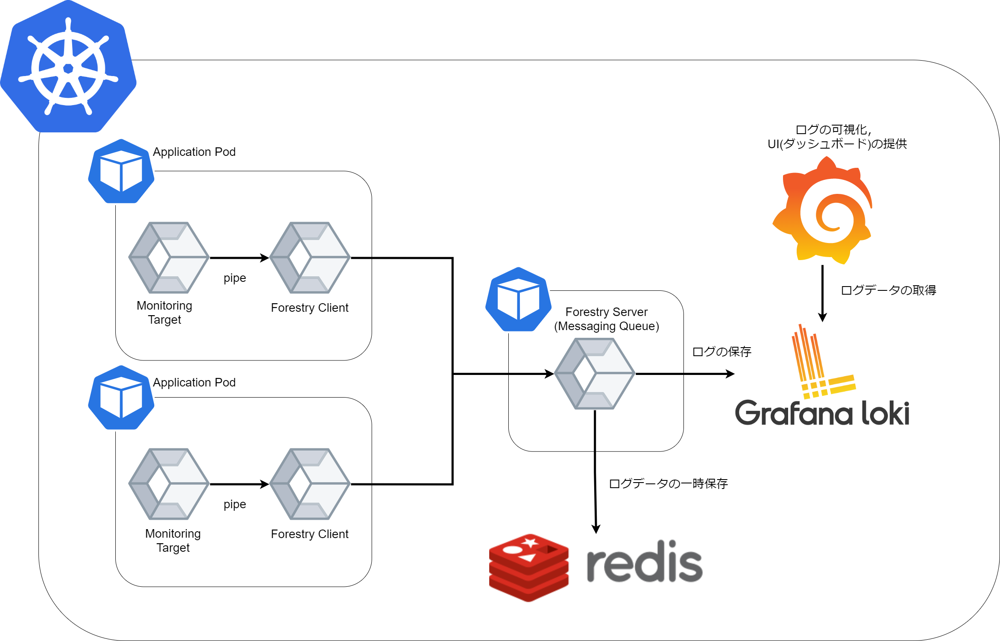

# forestry


Distributed Logging Platform

**Note**: This repository is created for demonstration.
We not assumption for production environment.



## Getting Started (local)

**Requirements**

- docker
- helm
- minikube(docker driver)
- kubectl

```
minikube start
kubectl get node -o wide
```

### Setup Grafana Loki

```
helm upgrade --install loki grafana/loki-stack --set grafana.enabled=true
kubectl get secret loki-grafana -o jsonpath="{.data.admin-password}" | base64 --decode ; echo
```

### Port-Forward

```
kubectl port-forward service/loki-grafana 3000:80 --address 0.0.0.0
```

Grafana
- username: admin
- password: `kubectl get secret loki-grafana ...`
